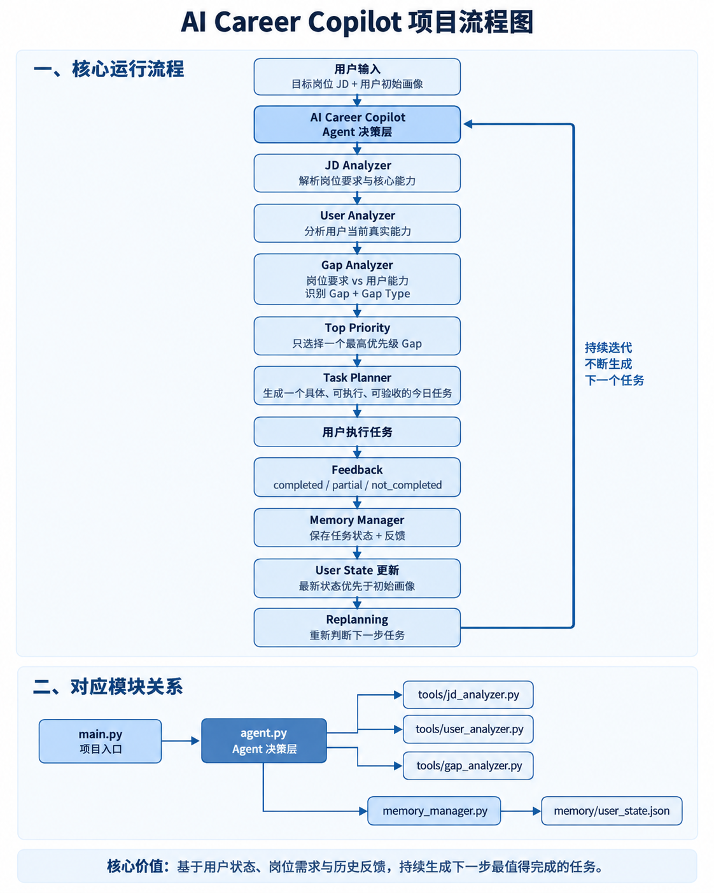

# AI Career Copilot

AI Career Copilot 是一个面向求职用户的 AI 求职智能体。

它的核心目标不是一次性回答“我该学什么”，而是结合用户目标岗位、当前能力、历史任务状态和执行反馈，持续判断用户当前最值得完成的下一项求职任务。

---

## 一、项目背景

求职过程中，用户通常会遇到三个问题：

1. 不清楚自己的能力与目标岗位之间到底差在哪里；
2. 即使知道自己有多个能力短板，也不知道当前应该优先补哪一个；
3. 普通大模型通常只能给出一次性建议，无法根据用户后续执行情况持续调整规划。

因此，本项目尝试构建一个具备 Tool Calling、Memory 和 Replanning 能力的 AI 求职 Agent，让系统能够根据用户状态持续进行下一步决策。

---

## 二、核心产品流程

整体流程：

**JD → JD Analyzer → User Analyzer → Gap Analyzer → Top Priority → Task Planner → 用户反馈 → Memory → Replanning**

具体过程：

1. 输入目标岗位 JD；
2. JD Analyzer 分析岗位要求；
3. User Analyzer 分析用户当前真实能力；
4. Gap Analyzer 对比岗位要求与用户能力；
5. 识别唯一的最高优先级 Gap；
6. 围绕该 Gap 生成一个具体、可执行、可验收的任务；
7. 用户反馈任务状态；
8. Memory 保存 completed / partial / not_completed 和具体 feedback；
9. Agent 根据最新状态重新规划下一步任务。

### 项目流程图




---

## 三、核心模块

### 1. JD Analyzer

负责动态解析目标岗位 JD，提取岗位核心能力、技术要求和加分项，为后续 Gap Analysis 提供结构化输入。

### 2. User Analyzer

负责分析用户当前真实能力，不仅参考初始用户画像，还会结合 `completed_tasks`、`pending_tasks`、`task_history` 和 `feedback` 判断最新状态。

核心原则：

> 初始画像不等于当前状态，最新任务证据优先。

### 3. Gap Analyzer

负责对比岗位要求与用户当前能力。

核心原则：

> 用户弱项不等于岗位 Gap。

只有同时满足：

**岗位需要 + 用户不足**

才可以进入 Gap。

同时区分不同 Gap 类型：

- `knowledge`：理论知识不足
- `practice`：缺少基础实践
- `experience`：缺少完整项目经验
- `depth`：已有实践但深度不足

最终只选择一个 `top_priority`。

### 4. Task Planner

根据最高优先级 Gap 生成一个具体任务。

任务需满足：

- 与 Gap 直接相关
- 有明确动作
- 有明确产出
- 可以验收
- 难度与用户当前阶段匹配

### 5. Memory Manager

负责保存任务状态和用户反馈，当前支持：

- `completed`
- `partial`
- `not_completed`

Memory 不只是保存历史，而是作为下一轮决策依据。

### 6. Replanning

Agent 根据最新任务状态重新规划：

- completed：不重复原任务，进入下一阶段
- partial：针对具体卡点继续推进
- not_completed：重新判断任务是否过难、过大或缺少前置知识

---

## 四、技术架构

项目主要使用：

- Python
- LangChain Agent
- Tool Calling
- ChatOpenAI 兼容接口
- 豆包大模型
- JSON Memory
- Prompt Engineering

当前核心 Tool：

- `analyze_jd`
- `analyze_user`
- `analyze_gap`

---

## 五、项目目录

```text
AI Career Copilot/
│
├── tools/
│   ├── jd_analyzer.py
│   ├── user_analyzer.py
│   └── gap_analyzer.py
│
├── memory/
│   └── user_state.json
│
├── assets/
│   └── ai-career-copilot-flow.png
│
├── agent.py
├── main.py
├── llm.py
├── memory_manager.py
│
├── evaluation_cases.py
├── test_jd_analyzer.py
├── test_user_analyzer.py
├── test_gap_analyzer.py
├── test_memory.py
│
├── requirements.txt
├── .gitignore
└── README.md
```

---

## 六、关键开发问题与优化

### 1. JD Analyzer 硬编码

早期 JD Analyzer 虽然接收 `jd_text`，但实际返回内容被写死为 AI 产品经理岗位。切换到后端 JD 后仍推荐 Agent，暴露了问题。后续改为基于真实 JD 动态解析，并通过“同一用户 + 不同 JD”验证不同岗位能够产生不同 Gap 和任务。

### 2. 用户弱项不等于岗位 Gap

早期系统容易把用户所有薄弱能力都纳入优先级判断。后续明确：

> Gap = 岗位需要 + 用户不足

JD 未要求的能力不能仅因用户较弱就进入高优先级。

### 3. Memory 写入不等于真正影响决策

曾出现 Memory 已记录 partial 和 feedback，但 Agent 仍按照初始画像重复安排基础任务的问题。后续将初始画像与最新 Memory 合并为 Current User Context，并规定最新 task_history、completed_tasks 和 feedback 优先于初始状态。

### 4. Gap 类型与 Task 类型不匹配

系统曾识别出 Agent Gap，却仍然生成阅读文章等学习任务。后续增加 `knowledge / practice / experience / depth` 分类，让 Task Planner 根据 Gap 类型生成对应任务。

### 5. 语义映射需要控制边界

只做关键词匹配时，RAG、Prompt、LangChain、Embedding 等实践无法被识别为“大模型应用能力”；语义映射过宽时，又可能把 PRD、SQL 等相关技能扩写成岗位核心要求。后续同时加入能力语义映射和岗位要求边界规则。

---

## 七、Evaluation

目前已设计多组跨岗位 Evaluation Case。

测试方式：

**不同 JD + 不同用户背景 → 人工设定预期 Top Priority → 与 Agent 实际结果比较**

第一轮共测试 5 个 Case：

- 4 个与人工预期一致
- 1 个存在合理分歧

这说明任务优先级类问题的 Ground Truth 不一定唯一。

后续计划结合：

- Rubric
- 人工复核
- LLM-as-a-Judge

进一步完善 Evaluation。

---

## 八、当前项目能力

当前版本已经实现：

- 动态 JD Analysis
- 用户能力分析
- Gap Analysis
- 唯一 Top Priority 判断
- Gap Type 判断
- Task Planning
- Tool Calling
- Memory 持久化
- completed / partial / not_completed 状态记录
- Feedback 驱动 Replanning
- 跨岗位动态测试
- 基础人工 Evaluation

当前已经形成完整闭环：

**目标岗位 → 用户状态 → Gap → Top Priority → 今日任务 → 用户反馈 → Memory → Replanning**

---

## 九、当前项目局限

当前版本仍存在以下不足：

1. Gap 优先级仍以 high / medium / low 启发式判断为主；
2. User Analyzer 能力评分尚未经过标准化校准；
3. Task Planner 有时生成任务颗粒度偏大；
4. Replanning 的任务难度递进仍需优化；
5. Evaluation 当前仍以人工 Case 为主；
6. Memory 当前主要通过 JSON 管理，任务继承关系仍比较粗。

---

## 十、后续优化方向

后续计划：

- 建立更稳定的能力评分与校准机制
- 增加 `task_id / parent_task_id` 管理任务继承关系
- 增加任务难度分级
- 增加自动化 Evaluation
- 增加更多真实 JD 测试
- 优化 Task Planner 任务颗粒度
- 增加可视化交互界面

---

## 十一、项目核心价值

AI Career Copilot 与普通“JD + 简历 → LLM 建议”的最大区别是：

> 它解决的不是一次性建议，而是持续的下一步决策。

普通大模型通常是：

**JD + 简历 → 一次性建议**

而 AI Career Copilot 的核心闭环是：

**JD + User State + History → Gap → Top Priority → Task → Feedback → Memory → Replanning**

项目核心能力可以概括为：

**State-aware + Feedback-driven + Continuous Replanning**