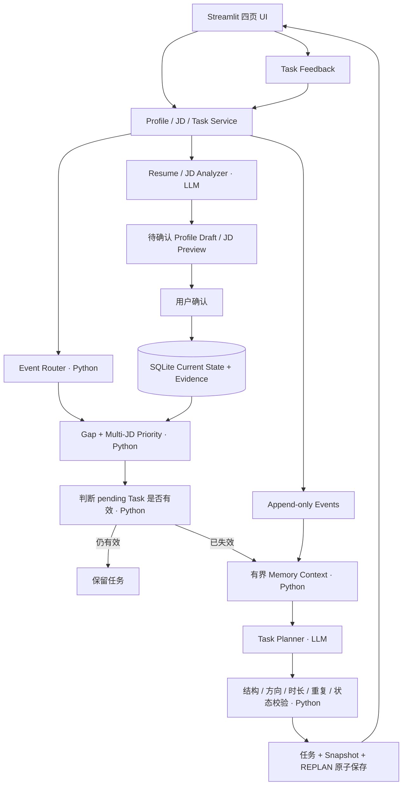

# V1.0 Architecture

单用户本地 Python 3.10 + Streamlit + sqlite3；模型为豆包 Ark，通过统一 llm.py 获取。PROJECT_SPEC.md 是唯一规格。

## 边界

Deterministic Workflow 管理确认、存储、等级、Gap、Priority、路由、去重和事务。Agentic Planning 仅在给定 Top Capability、下一等级和时间预算内设计具体任务。LLM 不决定 Priority 排名、不直接写库、不凭单次完成升级能力。

Current State 可更新；Evidence 保存来源和时间；Events 不提供更新/删除接口，SQLite trigger 阻止覆盖和删除。Draft 是暂存，确认才更新正式档案。Snapshot 保存当时输入、排名、任务和理由。

反馈状态、事件、Evidence、符合阈值的保守等级变化先原子提交；随后调用模型，不持有长写事务。生成失败保留已提交反馈，记录失败并允许重试。生成后核对 State，拒绝过期结果。

## Memory

SQLite 按能力检索最近最多 5 条相关 Task Event，另取最新 Feedback；Current State、Active JD 当前能力摘要、Priority 和 Capability Summary 组成上下文。历史原文不截断；入模副本受配置字符预算约束。Rolling Summary 增量使用旧摘要及水位之后的有界事件，成功才推进水位。无需 Vector Database。

## 模块

| 目录 | 责任 |
|---|---|
| core/ | Schema、校验、Gap、Priority、Planner、配置 |
| storage/ | sqlite3 Schema、迁移、Repository |
| parsers/、tools/ 中的 V1.0 Analyzer | 文件提取、LLM 结构化分析 |
| services/ | 业务事务、反馈、Memory、规划与路由 |
| ui/、app.py | 展示及显式 Service 调用 |
| evaluation/ | 冻结案例、同模型 Baseline、原始结果、AI盲评与未填写的人工评分模板 |

V0.x 的 main.py、agent.py、tools/、memory_manager.py 保留为历史参考，不是 V1.0 产品入口。不新增自定义 LangGraph 编排。

## V1.0 Owner Evaluation Release Decision — 2026-09-14

Evaluation：COMPLETE WITH LIMITATIONS。AC10：PARTIAL — ACCEPTED LIMITATION。External Human A/B Evaluation：NOT CONDUCTED（不是PASS），作为Future Work，不再阻塞本次V1.0 Release；不追加AI Judge或外部人工A/B评测。

Owner接受理由：真实用户Manual Smoke和Bad Case Retest已完成，Automatic Evaluation及两轮独立Blind AI Review已完成；Judge #1偏好Copilot 12 / Baseline 3 / Tie 1，Judge #2为13 / 3 / 0，Preferred Agreement=14/16=87.5%。对于当前个人项目V1.0，继续增加评审的边际收益较低。此为Owner接受限制，不是把AI评审当成人工评审。

自动指标State checks、Duplicate Rate、Coverage两方打平；AI评审中的稳定差异主要来自Task Actionability。Long History未体现Copilot稳定优势，不能宣称所有场景都胜出或统计显著。Copilot Constraint Violation Cases为Judge #1的4例、Judge #2的1例（Baseline分别11、10），口径分歧保留。Priority是准备优先级heuristic，非数学最优或最优ROI；能力升级基于用户自报Evidence，非客观考试认证。

Final Release以RELEASE_CHECKLIST.md的最终技术验证为准；接受Evaluation限制不豁免测试、依赖、安全与文档检查。历史评分和Run保持原样，旧的人工评审PENDING记录仅代表当时状态。
